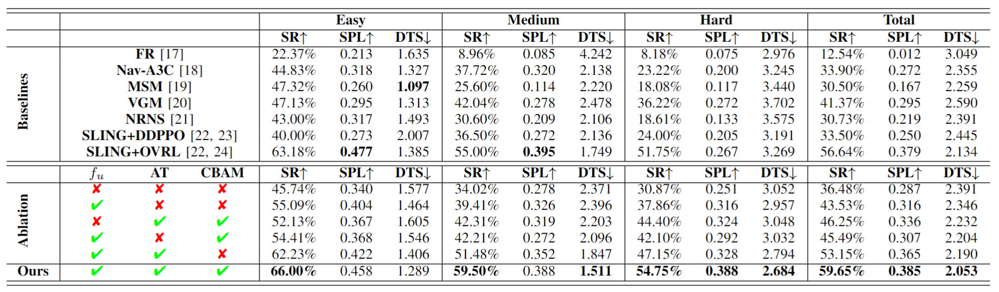

# Enhancing Exploratory Capability of Visual Navigation Using Uncertainty of Implicit Scene Representation

This is the official implementation of IROS 2024 paper "Enhancing Exploratory Capability of Visual Navigation Using Uncertainty of Implicit Scene Representation" created by Yichen Wang, Qiming Liu, Zhe Liu and Hesheng Wang.


## Abstract

In the context of visual navigation in unknown scenes, both "exploration" and "exploitation" are equally crucial. Robots must first establish environmental cognition through exploration and then utilize the cognitive information to accomplish target searches. However, most existing methods for image-goal navigation prioritize target search over the generation of exploratory behavior. To address this, we propose the Navigation with Uncertainty-driven Exploration (NUE) pipeline, which uses an implicit and compact scene representation, NeRF, as a cognitive structure. We estimate the uncertainty of NeRF and augment the exploratory ability by the uncertainty to in turn facilitate the construction of implicit representation. Simultaneously, we extract memory information from NeRF to enhance the robot's reasoning ability for determining the location of the target. Ultimately, we seamlessly combine the two generated abilities to produce navigational actions. Our pipeline is end-to-end, with the environmental cognitive structure being constructed online. Extensive experimental results on image-goal navigation demonstrate the capability of our pipeline to enhance exploratory behaviors, while also enabling a natural transition from the exploration to exploitation phase. This enables our model to outperform existing memory-based cognitive navigation structures in terms of navigation performance.

## Prequisites

```
python 3.8.12
CUDA 11.3
pytorch 1.10.0
tensorboard 2.14.0
numpy 1.22.2
igibson 2.0.6
g++ 9.3.0
```
iGibson is a simulation environment providing fast visual rendering and physics simulation based on Bullet. The download of igibson can be found at: [igibson](https://github.com/StanfordVL/iGibson)

## Datasets

### Scenes datasets
We use [igibson and gibson datasets](https://stanfordvl.github.io/iGibson/dataset.html) in our experiments. The data of the igibson dataset and gibson dataset should be organized as follows:
```
iGibson/
├── igibson/
│   ├── data/
│   │   ├── assets/
│   │   ├── ig_dataset/
│   │   ├── g_dataset/
│   │   │   ├── Adrian/
│   │   │   └── ...
│   │   └── igibson.key
```

### Training datasets
We use imitation learning to train NUE, utilizing a [waypoints dataset](https://github.com/StanfordVL/GibsonEnv/blob/master/gibson/data/README.md#dataset-splits) to gather the expert dataset needed for training.

After download the waypoints dataset, the data of the waypoints dataset should be organized as follows:
```
NUE-NeRF-nav/
├── navigation_scenarios/
│   ├── waypoints/
│   │   ├── tiny/
│   │   ├── medium/
│   │   ├── full/
│   │   └── full+/
```

To obtain the training dataset (expert dataset) for imitation learning from the waypoints dataset, run:

```
python sample.py
```

The data of the training dataset will be organized as follows:

```
NUE-NeRF-nav/
├── dataset/
│   ├── Pettigrew/
│   │   ├── 0000/
│   │   │   ├── observation.npy
│   │   │   ├── action.npy
│   │   │   └── ...
│   │   ├── 0001/
│   │   └── ...
```


## Training

Train the network by running
```
python main_imitate_navig.py
```
Please reminder to specify the `device_0`, `device_1`, `model_load`(path to model) in the scripts.

The training results will be saved in `summary_path`, the trained models will be saved in `model_path`.

## Testing

Please run
```
python test.py
```
Please reminder to specify the `device_0`, `device_1`, `model_load`(path to model) in the scripts.

The test results will be saved in `result_save_path`.

## Quantitative results:


